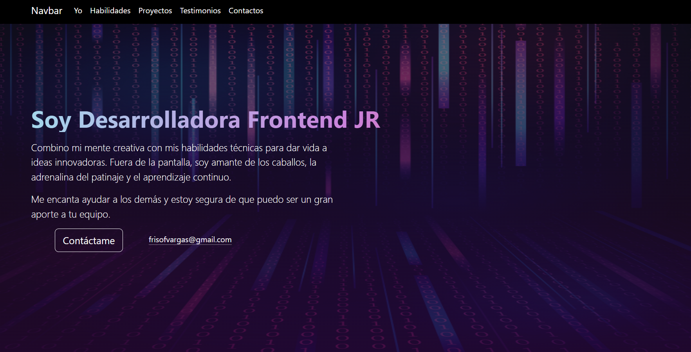

#   Mi Portafolio
<!--Primero va el objetivo-->

<!--Índice:Objetivo, Evidencia o demostración(link al proyecto ya en internet), Qué construimos, Tecnologías, Requisitos -->

<!--Evidencias, capturas de pantalla, link al proyeccto-->

El objetivo de este portafolio es demostrar mis habilidades en desarrollo de páginas web. 
  A través de mis proyectos, busco: 
- Mostrar Proyectos: Presentar ejemplos de mi trabajo en desarrollo web. 
- Demostrar Habilidades: Evidenciar mi dominio de tecnologías como HTML, CSS, JavaScript, y frameworks de frontend y backend. 
- Evidenciar Proceso: Documentar mi enfoque en planificación, diseño, implementación, pruebas y despliegue. 
- Recibir Retroalimentación: Obtener comentarios constructivos para mejorar mis habilidades. 
- Atraer Oportunidades: Mostrar mi trabajo a potenciales empleadores y clientes para buscar oportunidades profesionales. 
Espero que este portafolio refleje mi pasión por el desarrollo web y mi compromiso con la calidad.

[Link al proyecto:](https://miportafoliosofivargas.netlify.app/))
<bg>

<!--Descripción del proyecto, cómo se construyó-->

<!--Listan las herramientas ej(HTML, CSS, JS, Bootstrap, Typewriter JS)-->

<!--Pasos para instalar su proyecto y correrlo o puedes agregar los créditos del proyecto-->
